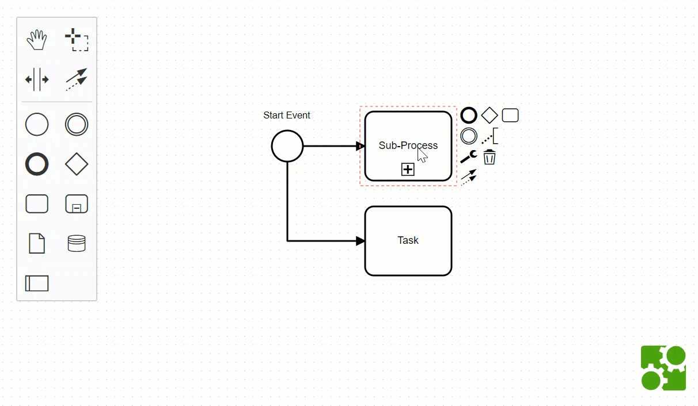

# diagram-js Element Detection

> :warning: This is a highly experimental feature! Do NOT use this in production!

An example of detecting elements at a given point. Overrides auto place feature to use element detection feature.



```javascript
const elementDetection = bpmnModeler.get('elementDetection');

// works with points
const point = {
  x: 100,
  y: 100
};

let detectedElements = elementDetection.detectAt(point);

// works with rects
const rect = {
  x: 100,
  y: 100,
  width: 100,
  height: 100
};

detectedElements = elementDetection.detectAt(rect);

const trbl = {
  top: 100,
  right: 200,
  bottom: 200,
  left: 100
};

detectedElements = elementDetection.detectAt(trbl);
```

# License

MIT